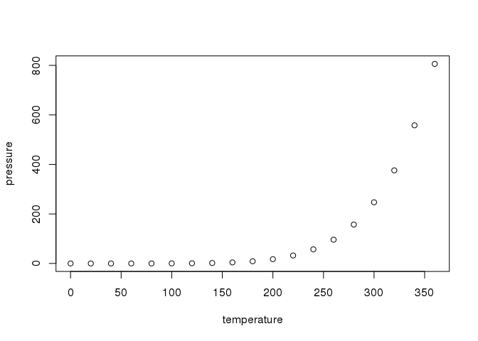

---
output:
  pdf_document: default
  html_document: default
---
Workflow
================

Data Analysis
-------------

This is an R Markdown format used for publishing markdown documents to GitHub. When you click the **Knit** button all R code chunks are run and a markdown file (.md) suitable for publishing to GitHub is generated.

Including Code
--------------

You can include R code in the document as follows:

``` r
summary(cars)
```

    ##      speed           dist       
    ##  Min.   : 4.0   Min.   :  2.00  
    ##  1st Qu.:12.0   1st Qu.: 26.00  
    ##  Median :15.0   Median : 36.00  
    ##  Mean   :15.4   Mean   : 42.98  
    ##  3rd Qu.:19.0   3rd Qu.: 56.00  
    ##  Max.   :25.0   Max.   :120.00

Including Plots
---------------

You can also embed plots, for example:



Note that the `echo = FALSE` parameter was added to the code chunk to prevent printing of the R code that generated the plot.

You can convert markdown to other format easily using Pandoc in Rstudio.
```r
library(knitr)
pandoc('input.md', format = 'latex')
pandoc('input.md', format = 'htmpl')
pandoc('input.md', format = 'pdf')
```

This summation expression $\sum_{i=1}^n X_i$ appears inline.


This summation expression is in display form.

$$\sum_{i=1}^n X_i$$

This math is inline $`a^2+b^2=c^2`$.

This is on a separate line
```math
a^2+b^2=c^2
```

=======

